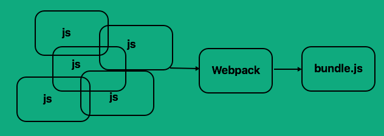

# [Tutoriel Webpack : comprendre comment il fonctionne](https://www.ag-grid.com/ag-grid-understanding-webpack/)

>**REMARQUE** : Cet article est une traduction en français de l'excellent article [Webpack Tutorial: Understanding How it Works](https://www.ag-grid.com/ag-grid-understanding-webpack/) écrit par [Sean Landsman](https://github.com/seanlandsman) de la société [ag-Grid](https://www.ag-grid.com/) avec son [aimable autorisation](https://www.ag-grid.com/ag-grid-understanding-webpack/#comment-3131781031)

## Motivation

Ce tutoriel Webpack est ma manière de documenter ce que j'ai appris. C'est aussi le blog que j'aurais aimé trouver lorsque j'ai commencé à parcourir Webpack il y a quelques mois.

Quand j'ai commencé à travailler chez ag-Grid (qui est un excellent endroit pour travailler !), j'ai dû monter en compétence sur de nombreuses technologies et frameworks que je n'avais pas utilisé jusqu'à présent. L'un d'eux était Webpack - un puissant *bundler* utilisé dans de nombreuses applications et frameworks.

Nous utilisons Webpack chez ag-Grid pour empaqueter (bundle) nos propres produits, afin de les utiliser avec nos exemples de framework. Bien qu'il existe des alternatives à Webpack, il est encore très populaire et avec la version 2.2 récemment publié, je crois qu'il le restera encore un bon moment.

## Introduction du tutoriel Webpack

Webpack est un *bundler* de module. Il prend des dépendances complétement différentes, crée des modules pour ces dépendances et regroupe tous les liens dans des fichiers faciles à utiliser. Ceci est particulièrement utile pour les [applications web monopage](https://fr.wikipedia.org/wiki/Application_web_monopage), qui est aujourd'hui la norme pour les applications Web.

Tout le code du blog peut être trouvé dans le dépôt [Webpack Tutorial: Understanding How it Works](https://github.com/seanlandsman/ag-grid-understanding-webpack) sur GitHub.

Supposons que nous avons une application qui peut effectuer deux tâches mathématiques simples - la somme et la multiplication. Nous décidons de séparer ces deux fonctions dans des fichiers distincts pour faciliter la maintenance :

```javascript
// sum.js
var sum = function (a, b) {
    return a + b;
};
```

```javascript
// multiply.js
// Ici de manière peu habituelle - nous allons répéter la fonction
// sum dans multiply pour illustrer l'interaction de dépendance
var multiply = function (a, b) {
    var total = 0;
    for (var i = 0; i < b; i++) {
        total = sum(a, total);
    }
    return total;
};
```

```javascript
// index.js - notre logique applicative
var totalMultiply = multiply(5, 3);
var totalSum = sum(5, 3);

console.log('Le produit de 5 et 3 = ' + totalMultiply);
console.log('La somme de 5 et 3 = ' + totalSum);
```

```html
// index.html - notre point d'entrée de notre application
<html>
<head>
    <script src="src/sum.js"></script>
    <script src="src/multiply.js"></script>
    <script src="src/index.js"></script>
</head>
</html>
```

L'affichage ressemblera à cela :

```console
Le produit de 5 et 3 = 15
La somme de 5 et 3 = 8
```

# Comment Webpack peut-il nous aider ?

## Dépendances - Les modules à la rescousse !

A partir du code ci-dessus, vous pouvez voir que `multiply.js` et `index.js` dépendent de `sum.js`. Nous pouvons montrer la hiérarchie des dépendances dans un diagramme simple :


Si nous utilisons un mauvais ordre dans `index.html` notre application ne fonctionnera pas. Si `index.js` est inclus avant l'une des deux autres dépendances, ou si `sum.js` est inclus après `multiply.js`, nous obtiendrons des erreurs.

Maintenant, imaginez une grosse application web - nous pouvons avoir des dizaines de dépendances, dont certaines dépendent les unes des autres. La gestion de l'ordre deviendrait un cauchemar !

Enfin, en utilisant des variables globales, nous risquons d'avoir d'autres codes qui écraseront nos variables, ce qui provoque des bogues difficiles à trouver.

Webpack peut convertir ces dépendances en modules - ils auront une portée beaucoup plus faible (ce qui est plus sûr). En plus, en convertissant nos dépendances en Modules, Webpack peut gérer nos dépendances pour nous - Webpack récupérera les Modules dépendants au bon moment, dans la bonne portée (nous verrons cela plus en détail plus tard).

## La mort à petit feu - Réduire le trafic

Si nous regardons `index.html`, nous pouvons voir que nous avons besoin de récupérer 3 fichiers distincts. C'est bien, mais maintenant imaginez à nouveau que nous avons beaucoup de dépendances - l'utilisateur final devra attendre que toutes les dépendances soient chargées avant que l'application principale puisse s'exécuter.

L'autre fonctionnalité principale qu'offre Webpack, c'est l'empaquetage (bundling). C'est-à-dire, Webpack peut récupérer toute nos dépendances dans un seul fichier, donc une seule dépendance devra être chargée.



L'empaquetage et la modularisation sont les principales fonctionnalités de Webpack. Grâce à des plugins et des chargeurs (loaders), nous pouvons l'étendre encore plus (nous le verrons plus tard), mais c'est principalement ce que fait Webpack.

# Rendre disponibles les dépendances et les relier

Pour notre configuration initiale, nous allons utiliser la syntaxe du module CommonJS. Il existe d'autres options (AMD, ES2015) mais pour l'instant nous allons utiliser CommonJS et passer ensuite à ES2015.

CommonJS utilise `module.exports` pour exporter - ou pour rendre disponible - les fonctions ou les variables à un autre code. Il utilise `require` pour ensuite récupérer ces valeurs exportées.

```javascript
// sum.js
var sum = function (a, b) {
    return a + b;
};
module.exports = sum;
```

```javascript
// multiply.js
var sum = require('./sum');

var multiply = function (a, b) {
    var total = 0;
    for (var i = 0; i < b; i++) {
        total = sum(a, total);
    }
    return total;
};
module.exports = multiply;
```

```javascript
// index.js - notre logique applicative
var multiply = require('./multiply');
var sum = require('./sum');

var totalMultiply = multiply(5, 3);
var totalSum = sum(5, 3);

console.log('Le produit de 5 et 3 = ' + totalMultiply);
console.log('La somme de 5 et 3 = ' + totalSum);
```

```html
// index.html - notre point d'entrée de notre application
<html>
<head>
    <script src="./dist/bundle.js"></script>
</head>
</html>
```

Veuillez noter que nous avons mis à la fois `sum` et `multiply` disponibles pour d'autres codes et que nous avons récupéré ces fonctions exportées dans `multiple.js` et `index.js`.

Notez également que notre `index.html` n'a plus qu'à récupérer un seul fichier - `bundle.js`.

C'est bien ! Nous n'avons plus à nous préoccuper de l'ordre des dépendances. Nous pouvons exposer ce que nous voulons et garder le reste du code effectivement privé. Nous réduisons également les appels web de 3 (`sum.js`, `multiply.js` et `index.js`) à un seul appel - cela aidera à accélérer les temps de chargement.

# Webpack - Configuration initiale

Pour que ce qui précède fonctionne, nous devons faire une configuration initiale de Webpack :

```javascript
var path = require('path');
module.exports = {
    entry: './src/index.js',
    output: {
        path: path.resolve(__dirname, './dist/'),
        filename: 'bundle.js'
    }
}
```

Au minimum, nous devons indiquer à Webpack quel est le point d'entrée de votre application et où doit être généré le résultat.

`entry`: C'est le point d'entrée principale de notre application. C'est où se trouve notre chargement initial et où sera la logique applicative. Webpack utilise ceci comme point de départ pour parcourir l'arborescence des dépendances. Il créera un graphe de dépendance et créera si nécessaire des modules.

`output.path`: Un chemin absolu pour le *bundle* généré. Pour que cela soit multi-plateforme et facile à utiliser, nous utilisons une fonction intégré de Node.js (`path`). Cela nous aidera à créer dynamiquement un chemin absolu, par rapport à l'endroit où nous sommes.

`output.filename`: Le nom du fichier du *bundle* généré. Cela peut être n'importe quoi, mais par convention, il est appelé `bundle.js`.

**Note**: `__dirname` est une variable utile de Node.js - c'est le répertoire où se trouve le fichier courant.

# Explorons bundle.js

Regarder le `bundle.js` généré peut être très instructif (il a été mise en forme et documenté pour faciliter sa lecture) :

```javascript
// Le bootstrap de webpack
(function (modules) {
    // Le cache du module
    var installedModules = {};

    // La fonction require
    function __webpack_require__(moduleId) {
        // Vérifie si le module est dans le cache
        // Crée un nouveau module (et le met dans le cache)
        // Exécute la fonction du module
        // Marque le module comme chargé
        // Retourne les exports du module
    }


    // expose l'objet des modules (__webpack_modules__)
    // expose le cache du module
    // charge le module d'entrée et retourne les exports
    return __webpack_require__(0);
})
/************************************************************************/
([
    // index.js - notre logique applicative
    /* 0 */
    function (module, exports, __webpack_require__) {

        var multiply = __webpack_require__(1);
        var sum = __webpack_require__(2);

        var totalMultiply = multiply(5, 3);
        var totalSum = sum(5, 3);

        console.log('Le produit de 5 et 3 = ' + totalMultiply);
        console.log('La somme de 5 et 3 = ' + totalSum);
    },
    // multiply.js
    /* 1 */
    function (module, exports, __webpack_require__) {

        var sum = __webpack_require__(2);

        var multiply = function (a, b) {
            var total = 0;
            for (var i = 0; i < b; i++) {
                total = sum(a, total);
            }
            return total;
        };
        module.exports = multiply;
    },
    // sum.js
    /* 2 */
    function (module, exports) {

        var sum = function (a, b) {
            return a + b;
        };
        module.exports = sum;
    }
]);
```

Comme vous pouvez le voir, Webpack enveloppe chacun de nos fichiers dans un module et les transmet dans le bootstrap de Webpack comme un tableau de modules. Pour chaque module, il les ajoute à Webpack, les exécute et les rend disponibles pour les autres modules.

Il exécute `__webpack_require__(0)` ce qui correspond dans le tableau des modules à notre `index.js`. Le résultat est le même que celui du début, mais avec une gestion de dépendance plus facile et moins de trafic web ! Génial !

# Les chargeurs - rendre Webpack plus intelligent

Webpack comprend JavaScript. Il peut créer des modules et empaqueter du JavaScript hors de la boîte, mais si vous voulez utiliser quelque chose d'autre que du JavaScript, ou si vous voulez écrire sous ES2015/ES6, alors vous devez dire à Webpack comment traiter cela.

Plus précisément, nous devons pré-traier ces autres langages/versions dans du JavaScript ES5 - la version que Webpack peut comprendre.

Ici à ag-Grid, nous sommes de grands fans de TypeScript, mais pour les besoins de cet exemple, nous allons convertir notre code d'exemple en ES2015 et utiliser Babel pour convertir (ou transpiler) notre code ES2015 en du JavaScript compatible ES5.

Babel peut faire beaucoup d'autres choses que simplement transpiler le code ES2015 en ES5, mais cela dépasse le sujet de l'article. Veuillez consulter le site [Babel](https://babeljs.io/) pour plus d'informations sur Babel.

Tout d'abord, nous allons convertir notre code ES5 en ES2015 :

```javascript
// sum.js
const sum = (a, b) => a + b;

export default sum;
```

```javascript
// multiply.js
import sum from './sum';

const multiply = (a, b) => {
    let total = 0;
    for(let i=0;i<b;i++) {
        total = sum(a, total);
    }
    return total;
};

export default multiply;
```

```javascript
// index.js - notre logique applicative
import multiply from './multiply';
import sum from './sum';

const totalMultiply = multiply(5, 3);
const totalSum = sum(5, 3);

console.log(`Le produit de 5 et 3 = ${totalMultiply}`);
console.log(`La somme de 5 et 3 = ${totalSum}`);
```

```html
// index.html n'a pas changé
```

Ici, nous utilisons les fonctions fléchées, le mot clé `const`, les chaînes de template et la syntaxe de module import/export de es2015, qui sont toutes des fonctionnalités ES2015.

Pour utiliser Babel, nous avons besoin d'utiliser Babel Loader. Les chargeurs sont la manière permettant à Webpack de traiter du contenu autre que du JavaScript. Grâce aux chargeurs, nous pouvons traiter avec Webpack de nombreux types de fichiers - CSS, images, code TypeScript, ES2015 et ainsi de suite.

Nous avons besoin de 3 dépendances de Babel pour l'utiliser avec Webpack :
* `babel-loader` : L'interface entre Babel et Webpack
* `babel-core` : Il contient la manière de lire et d'analyser le code et de générer la sortie correspondante
* `babel-preset-es2015` : Les règles pour Babel sur la façon de traiter le code ES2015 et de le convertir en ES5

La configuration de Webpack avec le Babel Loader en place ressemble à ceci :

```javascript
const path = require('path');

module.exports = {
    entry: './src/index.js',
    output: {
        path: path.resolve(__dirname, './dist/'),
        filename: 'bundle.js'
    },
    module: {
        loaders: [
            {
                test: /\.js$/,
                loader: 'babel-loader',
                exclude: /node_modules/,
                query: {
                    presets: ['es2015']
                }
            }
        ]
    }
};
```

Comme nous pouvons avoir un certain nombre de chargeurs dans Webpack, les valeurs fournies sont dans un tableau - dans notre cas, nous ne fournissons initialement qu'un chargeur.

* `test` : Nous devons dire au chargeur que nous voulons seulement qu'il traite des fichiers JavaScript. Nous ne voulons pas qu'il recherche des fichiers CSS, HTML, images et ainsi de suite - uniquement des fichiers JavaScript (.js). Pour ce faire, nous fournissons une expression regex qui correspondra aux fichiers .js
* `loader`: Le chargeur à utiliser - dans notre cas Babel Loader
* `exclude`: Nous ne voulons pas que Babel traite tous les fichiers sous `node_modules`
* `query.presets`: Quels preset Babel (ou règles) nous voulons appliquer - dans notre cas, nous utilisons Babel pour convertir le code ES2015

En regardant à nouveau notre `bundle.js` (et cette fois en regardant seulement la partie qui contient `sum.js`), nous pouvons voir ce qui suit :

```javascript
/* 2 */
function(module, exports) {
    var sum = function sum(a, b) {
        return a + b;
    };

    module.exports = sum;
}
```

Donc, Babel Loader a converti notre code ES2015 en code ES5 - super ! Le meilleur des deux mondes.

# Améliorer l'apparence de Webpack - CSS & Style

Améliorons notre exemple pour afficher effectivement les résultats de nos calculs. Nous allons créer un body sur la page, puis ajoutez les résultats du produit et de la somme à des spans, que nous ajouterons au body :

```javascript
// index.js - notre logique applicative
import multiply from './multiply';
import sum from './sum';

const totalMultiply = multiply(5, 3);
const totalSum = sum(5, 3);

// créer le body
const body = document.createElement("body");
document.documentElement.appendChild(body);

// calcule le produit et l'ajoute à un span
const multiplyResultsSpan = document.createElement('span');
multiplyResultsSpan.appendChild(document.createTextNode(`Le produit de 5 et 3 = ${totalMultiply}`));

// calcule la somme et l'ajoute à un span
const sumResultSpan = document.createElement('span');
sumResultSpan.appendChild(document.createTextNode(`La somme de 5 et 3 = ${totalSum}`));

// ajoute les résultats à la page
document.body.appendChild(multiplyResultsSpan);
document.body.appendChild(sumResultSpan);
```

L'affichage sera le même que précédemment, mais dans une page :

```console
Le produit de 5 et 3 = 15La somme de 5 et 3 = 8
```

Nous pouvons améliorer cela avec du CSS - nous allons nous assurer que chaque résultat est sur une nouvelle ligne et ajouter une bordure autour de chaque résultat.

Notre CSS ressemblera à ceci :

```css
// math_output.css
span {
    border: 5px solid brown;
    display:block;
}
```

Nous devons récupérer ce CSS dans notre application. Nous pourrions bien sûr simplement ajouter une balise link à notre html, mais si nous l'importons et ensuite utilisons Webpack pour le traiter, nous allons profiter de ce que Webpack peut offrir.

Un avantage supplémentaire d’importer le CSS dans notre code, c’est que nous (les développeurs) voyons où est l’association entre le CSS et son utilisation. Il est intéressant de noter que le CSS n'est pas limité au module auquel il est importé (il est encore global), mais du point de vue des développeurs, la relation est plus claire.

```javascript
// index.js - notre logique applicative
import multiply from './multiply';
import sum from './sum';

// importe le CSS que nous voulons utiliser ici
import './math_output.css';

const totalMultiply = multiply(5, 3);
const totalSum = sum(5, 3);

// créer le bodyNous avons besoin de deux chargeurs pour traiter notre CSS :
const body = document.createElement("body");
document.documentElement.appendChild(body);

// calcule le produit et l'ajoute à un span
const multiplyResultsSpan = document.createElement('span');
multiplyResultsSpan.appendChild(document.createTextNode(`Le produit de 5 et 3 = ${totalMultiply}`));

// calcule la somme et l'ajoute à un span
const sumResultSpan = document.createElement('span');
sumResultSpan.appendChild(document.createTextNode(`La somme de 5 et 3 = ${totalSum}`));

// ajoute les résultats à la page
document.body.appendChild(multiplyResultsSpan);
document.body.appendChild(sumResultSpan);
```

L'unique changement avant la modification, c'est que nous importons maintenant le CSS.

Nous avons besoin de deux chargeurs pour traiter notre CSS :
* `css-loader` : Sait comment traiter les importations CSS - prend le CSS importé et charge le contenu du fichier
* `style-loader` : Récupère les données du CSS (grâce aux imports) et les ajoute au document HTML

Notre config Webpack ressemble maintenant à ceci :

```javascript
const path = require('path');

module.exports = {
    entry: './src/index.js',
    output: {
        path: path.resolve(__dirname, './dist/'),
        filename: 'bundle.js'
    },
    module: {
        loaders: [
            {
                test: /\.js$/,
                loader: 'babel-loader',
                exclude: /node_modules/,
                query: {
                    presets: ['es2015']
                }
            },
            {
                test: /\.css$/,
                loaders: ['style-loader', 'css-loader']
            }
        ]
    }
};
```

* `test` : comme précédemment, nous avons besoin de dire aux chargeurs que nous voulons seulement traiter les fichiers CSS - ce regex ne traitera que les fichiers .css
* `loaders` : les chargeurs à utiliser. Notez que cette fois, c'est au pluriel car nous fournissons un tableau de chargeurs. Notez également que Webpack traite les chargeurs **de droite à gauche**, de sorte que les résultats de `css-loader` (le contenu du fichier) soit transmis à `style-loader` (en ajoutant les styles au document HTML)

Si nous exécutons maintenant Webpack et rechargeons notre application, l'affichage ressemblera à ceci :


En coulisses, ces deux chargeurs ont ajouté dynamiquement les styles au document HTML. Si nous inspectons le HTML résultant dans Chrome, nous pouvons voir ce qui suit :


C’est intelligent, mais il existe pour nous d’autres moyens de traiter le CSS. Nous pouvons découper le CSS en ["cachebusting"](https://fr.wiktionary.org/wiki/cachebusting) (fichiers avec des empreintes uniques) et ensuite inclure ces fichiers dans notre bundle généré.

Pour l'instant, nous allons simplement extraire le CSS et le mettre dans un fichier que nous pouvons ensuite importer. Pour faire cela, nous allons utiliser un Plugin : ExtractTextPlugin.

Les chargeurs sont utilisés pour le prétraitement des données avant leur extraction dans notre bundle. Les plugins peuvent aussi empêcher l'extraction dans notre bundle.

Notre config Webpack ressemble maintenant à ceci :

```javascript
const path = require('path');
const ExtractTextPlugin = require('extract-text-webpack-plugin');

module.exports = {
    entry: './src/index.js',
    output: {
        path: path.resolve(__dirname, './dist/'),
        filename: 'bundle.js'
    },
    module: {
        loaders: [
            {
                test: /\.js$/,
                loader: 'babel-loader',
                exclude: /node_modules/,
                query: {
                    presets: ['es2015']
                }
            },
            {
                test: /\.css$/,
                loader: ExtractTextPlugin.extract('css-loader')
            }
        ]
    },
    plugins: [
        new ExtractTextPlugin('style.css')
    ]
};
```

Au début du fichier, nous importons ExtractTextPlugin. Nous avons également modifié le chargeur de CSS pour utiliser ce plugin :

```javascript
{
    test: /\.css$/,
    loader: ExtractTextPlugin.extract('css-loader')
}
```

Cela indique à Webpack de transmettre les générations de css-loader à ExtractTextPlugin. Plus bas, nous configurons le plugin :

```javascript
plugins: [
    new ExtractTextPlugin('style.css')
]
```

Ceci permet de dire au plugin qu'il doit, pour toutes les données qui lui sont transmises, les enregistrer dans un fichier appelé `style.css`. Dans un premier temps, cela peut sembler inutile, mais comme nous l'avons vu précédemment avec de nombreux fichiers JavaScript distincts, imaginez que nous avions de nombreux fichiers CSS. En faisant ce qui précède, nous pouvons combiner plusieurs fichiers CSS distincts en un seul fichier, ce qui réduit le nombre d'appels Web au moment du chargement.

En regardant dist/style.css, nous pouvons voir :

```css
span {
    border: 5px solid brown;
    display:block;
}
```

C'est évidement le contenu de notre CSS. Pour l'utiliser, nous devons modifier notre `index.html` pour importer ce CSS :

```html
// index.html - notre point d'entrée de notre application
<html>
<head>
    <link rel="stylesheet" href="dist/style.css"/>
    <script src="./dist/bundle.js"></script>
</head>
</html>
```

L'affichage sera le même que précédemment.

# Une image vaut mieux qu'un long discours

Ajoutons quelques images à notre application - et demandons à Webpack (avec un chargeur approprié) de les traiter pour nous.

Ajoutons deux nouvelles images à notre projet, une petite et une grande - une pour la somme et une pour la multiplication, juste pour ajouter un peu de couleur à notre affichage.

Afin de traiter ces images, nous allons faire usage de deux chargeurs :
* `image-webpack-loader` : essaiera à notre place de compresser automatiquement les grandes images
* `url-loader` : si les images sont petites, il intégrera les résultats de `image-webpack-loader` et si elles sont trop grandes, il inclura les images dans le répertoire d'extraction

Nous avons deux nouvelles images que nous voulons ajouter - `multiply.png` qui est assez grosse (environ 32kb) et `sum.png` qui est relativement petite (environ 13kb).

Tout d'abord, ajoutons une nouvelle classe d'utilitaire d'image - cela nous créera une nouvelle image et l'ajoutera au document :

```javascript
// image_util.js
const addImageToPage = (imageSrc) => {
    const image = document.createElement('img');
    image.src = imageSrc;
    image.style.height = '100px';
    image.style.width = '100px';
    document.body.appendChild(image);
};

export default addImageToPage;
```

Importons à la fois le nouvel utilitaire d'image ainsi que les images que nous voulons ajouter à notre application :

```javascript
// index.js - notre logique applicative
import multiply from './multiply';
import sum from './sum';

// importe notre utilitaire d'image
import addImageToPage from './image_util';

// importe les images que nous voulons utiliser ici
import multiplyImg from '../images/multiply.png';
import sumImg from '../images/sum.png';

// importe le CSS que nous voulons utiliser ici
import './math_output.css';

const totalMultiply = multiply(5, 3);
const totalSum = sum(5, 3);

// crée le body
const body = document.createElement("body");
document.documentElement.appendChild(body);

// calcule le produit et l'ajoute à un span
const multiplyResultsSpan = document.createElement('span');
multiplyResultsSpan.appendChild(document.createTextNode(`Le produit de 5 et 3 = ${totalMultiply}`));

// calcule la somme et l'ajoute à un span
const sumResultSpan = document.createElement('span');
sumResultSpan.appendChild(document.createTextNode(`La somme de 5 et 3 = ${totalSum}`));

// ajoute les résultats à la page
addImageToPage(multiplyImg);
document.body.appendChild(multiplyResultsSpan);

addImageToPage(sumImg);
document.body.appendChild(sumResultSpan);
```

Enfin, nous allons configurer Webpack pour traiter ces images avec les deux nouveaux chargeurs :

```javascript
const path = require('path');
const ExtractTextPlugin = require('extract-text-webpack-plugin');

module.exports = {
    entry: './src/index.js',
    output: {
        path: path.resolve(__dirname, './dist/'),
        filename: 'bundle.js',
        publicPath: 'dist/'
    },
    module: {
        loaders: [
            {
                test: /\.js$/,
                loader: 'babel-loader',
                exclude: /node_modules/,
                query: {
                    presets: ['es2015']
                }
            },
            {
                test: /\.css$/,
                loader: ExtractTextPlugin.extract('css-loader')
            },
            {
                test: /\.png$/,
                loaders: [
                    'url-loader?limit=5000',
                    'image-webpack-loader'
                ]
            }
        ]
    },
    plugins: [
        new ExtractTextPlugin('style.css')
    ]
};
```

* `output.publicPathAllows` : Permet à `url-loader` de savoir quel préfixe il doit ajouter aux fichiers qui seront enregistrés sur le disque. Par exemple, un résultat de `img.src` pourrait être `img.src='dist/output_file.png'`
* `test` : comme précédemment, nous avons besoin de dire aux chargeurs que nous voulons seulement traiter les fichiers images - ce regex ne traitera que les fichiers `.png`. Nous pouvons rendre cela plus complexe en ajoutant un support pour d'autres formats d'image, dans notre cas, ce simple regex suffira
* `loaders` : nos chargeurs à utiliser - N'oubliez pas que Webpack traite les chargeurs de droite à gauche, donc les résultats de `image-webpack-loader` seront passés à `url-loader`

Si nous exécutons maintenant Webpack, nous verrons quelque chose comme ceci :

```console
38ba485a2e2306d9ad96d479e36d2e7b.png
bundle.js
style.css
```
Si vous ouvrez `38ba485a2e2306d9ad96d479e36d2e7b.png`, nous devrions trouver notre grande image - `multiply.png`. La petite image, `sum.png`, a été intégrée dans `bundle.js` comme suit :

```javascript
module.exports = "data:image/png;base64,iVBORw0KGgoAAAANSUhEUgAAAoAAAAHgCAMAAAACDyzWAAAC6FBMVEUAuv8AgL...."
```

Ce qui équivaut à avoir :

```javascript
img.src="data:image/png;base64,iVBORw0KGgoAAAANSUhEUgAAAoAAAAHgCAMAAAACDyzWAAAC6FBMVEUAuv8AgL..."
```

Lorsque nous exécutons notre application, l'affichage est le suivant :


Grâce à ce tutoriel, vous avez pu voir ce que Webpack peut nous offrir à nous les développeurs d'applications. Avec peu de configuration, nous avons pu traiter le code ES2015, l'empaqueter, gérer les CSS et traiter les grosses et les petites images, le tout dans une méthode facile à comprendre.

Nous avons réalisé tout cela et nous venons tout juste de gratter la surface de ce que Webpack peut faire. Nous pouvons minifier le code, diviser le code dans des noms de fichiers via du [cachebusting](https://fr.wiktionary.org/wiki/cachebusting), traiter TypeScript et Angulaire 2+ - il y a tellement d'options !

En adoptant Webpack - je suis sûr que vous trouverez un outil indispensable dans votre kit de développement.
