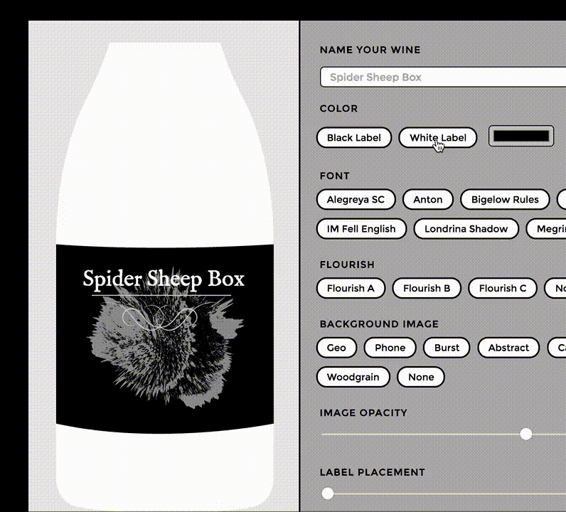
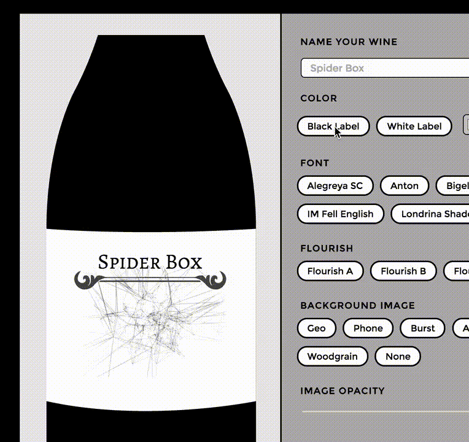

# Intro à Vue.js : Composants, Props et Slots

>**REMARQUE** : Cet article est une traduction en français de l'excellent article ["Intro to Vue.js: Components, Props, and Slots"](https://css-tricks.com/intro-to-vue-2-components-props-slots/) écrit par [Sarah Drasner](https://github.com/sdras)

## Introduction

Il s’agit du deuxième volet d’une série en cinq parties sur le framework JavaScript [Vue.js](https://vuejs.org/). Dans cette partie, nous allons passer en revue les composants, les Props et les Slots. Il ne s'agit pas d'un guide complet, mais plutôt d'un aperçu des principes fondamentaux pour vous aider, pour connaître Vue.js et comprendre ce que peut vous offrir le framework.

> Série d'article :
>  1. [Rendu, directives et événements](../intro-to-vue-1-rendering-directives-events)
>  2. Composants, Props et Slots (Ce document !)
>  3. [Vue-cli](../intro-to-vue-3-vue-cli-lifecycle-hooks)
>  4. [Vuex](../intro-to-vue-4-vuex)
>  5. [Animations](../intro-to-vue-5-animations)

## Composants et passage de données

Si vous êtes familier avec React ou Angular2, l'idée de composants et de passage d'état ne vous sera pas inconnu. Si vous n'êtes pas dans ce cas, voyons quelques-uns des principaux concepts.

Les grands et les petits sites web sont généralement composés de plusieurs morceaux. Le découpage en petits morceaux permet de mieux structurer, de réutiliser et de rendre notre code plus lisible. Au lieu de mettre tout le balisage dans une longue page multifacette, nous pourrions le constituer de plusieurs composants comme ceci :

```HTML
<header></header>
<aside>
	<sidebar-item v-for="item in items"></sidebar-item>
</aside>
<main>
	<blogpost v-for="post in posts"></blogpost>
</main>
<footer></footer>
```

C'est un exemple simplifié, mais vous pouvez voir à quel point ce type de composition peut être utile lorsque vous commencez à construire la structure de votre site. Si vous deviez plonger dans ce code en tant que mainteneur, vous iriez vite pour comprendre : comment l'application est structurée et où chercher chaque morceau.

Vue nous permet de créer des composants de différentes façons. Nous irons du plus simple au plus complexe, en gardant à l'esprit que l'exemple le plus complexe est celui qui sera le plus souvent utilisé avec Vue dans une application moyenne.

JS :
```javascript
app.$mount('#app');

var app = new Vue({
	el: 'hello',
	template: '<h1>Hello World!</h1>'
});
```

Cela fonctionne, mais ce n’est pas très utile, car ça ne peut être utilisé qu'une seule fois et que nous ne transmettons pas encore l’information aux différents composants. Une façon de transférer des données d’un parent à un enfant est appelé **props**.

C'est un exemple aussi simple que je pourrais le faire, de sorte qu'il soit super clair. N’oubliez pas que :text dans le HTML est un raccourci pour la liaison pour Vue.
This is as simple an example as I could make, so that it's super clear. Remember that the `:text` in the HTML is a shortcut for Vue binding. We covered this last time in the section on directives. Binding can be used for all kinds of things but in this instance, it keeps us from having to place the state in a mustache template, like this `{{ message }}`.

In the code below, `Vue.component` is the **component**, and `new Vue` is called the **instance**. You can have more than one instance in an application. Typically, we'll have one instance and several components, as the instance is the main app.

JS :
```javascript
Vue.component('child', {
	props: ['text'],
	template: `<div>{{ text }}<div>`
});

new Vue({
	el: "#app",
	data() {
		return {
			message: 'hello mr. magoo'
		}
	}
});
```

HTML :
```HTML
<div id="app">
	<child :text="message"></child>
</div>
```

*[Démo](http://codepen.io/sdras/pen/788a6a21e95589098af070c321214b78)*

Now we can reuse this component as many times as we like through our application:

HTML :
```HTML
<div id="app">
	<child :text="message"></child>
	<child :text="message"></child>
</div>
```

*[Démo](http://codepen.io/sdras/pen/9c04bdcf1a2d0c770d6a1fd4af3c66f3)*

We can also add validation to our props, which is similar to `PropTypes` in React. This is nice because it's self-documenting, and will return an error if it's not what we expected, but only in development mode:

JS :
```javascript
Vue.component('child', {
	props: {
		text: {
			type: String,
			required: true
		}
	},
	template: `<div>{{ text }}<div>`
});
```

In the example below, I'm loading Vue in development mode, and purposefully passing an invalid type into our prop validation. **You can see the error in the console.** (It also helpful lets you know you can use Vue's devtools and where to find them).

JS :
```javascript
Vue.component('child', {
	props: {
		text: {
			type: Boolean,
			required: true
		}
	},
	template: `<div>{{ text }}<div>`
});
```

*[Démo](http://codepen.io/sdras/pen/d6fcaeee50a530d9a5e5832f0aec0773)*

Objects should be returned as a factory function and you can even pass as a custom validator function, which is really nice because you can check values against business, input, or other logic. There's a nice write-up of how you'd use each type [in the guide here](https://vuejs.org/v2/guide/components.html#Prop-Validation).

You don't need to necessarily pass the data in props to the child, either, you have the option of using state or a static value as you see fit:

JS :
```javascript
Vue.component('child', {
	props: {
		count: {
			type: Number,
			required: true
		}
	},
	template: `<div class="num">{{ count }}</div>`
})

new Vue({
	el: '#app',
	data() {
		return {
			count: 0
		}
	},
	methods: {
		increment() {
			this.count++;
		},
		decrement() {
			this.count--;
		}
	}
})
```

HTML :
```HTML
<div id="app">
	<h3>
		<button @click="increment">+</button>
		Adjust the state
		<button @click="decrement">-</button>
	</h3>
	<h2>This is the app state: <span class="num">{{ count }}</span></h2>
	<hr>
	<h4><child count="1"></child></h4>
	<p>This is a child counter that is using a static integer as props</p>
	<hr>
	<h4><child :count="count"></child></h4>
	<p>This is the same child counter and it is using the state as props</p>
</div>
```

*[Démo](http://codepen.io/sdras/pen/5a34f6ed12cf954202c6d38f1ceba633)*

The difference is whether or not you’re passing a property and binding it:

**Not using the state**
`<child count="1"></child>`

vs

**Using the state**
`<child :count="count"></child>`

Up until now, we've been creating content in our child component with a string, and of course if you’re using babel so that you can process ES6 in all browsers (which I highly suggest), you could use a [template literal](https://developer.mozilla.org/en-US/docs/Web/JavaScript/Reference/Template_literals) to avoid potentially hard-to-read string concatenation:

JS :
```javascript
Vue.component('individual-comment', {
	template:
	`<li> {{ commentpost }} </li>`,
	props: ['commentpost']
});

new Vue({
	el: '#app',
	data: {
		newComment: '',
		comments: [
			'Looks great Julianne!',
			'I love the sea',
			'Where are you at?'
		]
	},
	methods: {
		addComment: function () {
			this.comments.push(this.newComment)
			this.newComment = ''
		}
	}
});
```

HTML :
```HTML
<ul>
	<li
		is="individual-comment"
		v-for="comment in comments"
		v-bind:commentpost="comment"
	></li>
</ul>
<input
	v-model="newComment"
	v-on:keyup.enter="addComment"
	placeholder="Add a comment"
>
```

*[Démo](http://codepen.io/sdras/pen/cd81de1463229a9612dca7559dd666e0)*

This is a little more useful, but there's still a limit to how much content we probably want to put in that string, even with the help of template literals. Eventually in this comment form we'd want to have photos and the names of the authors, and you can already probably guess how crowded it would get with all that information. We also won't have any useful syntax highlighting within that string.

With all those things in mind, let’s create a template. We'll wrap some regular HTML in special script tags and use an id to reference it to create a component. You can see that this is a lot more legible when we have a lot of text and elements:

HTML :
```HTML
<!-- This is the Individual Comment Component -->
<script type="text/x-template" id="comment-template">
<li>
	
	<small>{{ commentpost.author }}</small>
	<p class="post-comment">"{{ commentpost.text }}"</p>
</li>
</script>
```

JS :
```javascript
Vue.component('individual-comment', {
	template: '#comment-template',
	props: ['commentpost']
});
```

*[Démo](http://codepen.io/sdras/pen/egEgXb)*

## Slots

This is a lot better. But what happens when we have two components with slight variations, either content or style deviations? We could pass all the different content and styles down into the component with props, and switch everything out each time, or we could fork the components themselves and create different versions of them. But it would be really nice if we could reuse the components, and populate them with the same data or functionality. This is where slots come in really handy.

Let's say we have a main app instance using the same `<app-child>` component twice. Inside each child we want some of the same content, and some different content. For the content we want to stay consistent, we would use a standard p tag, and for the content we want to switch out, we'll put an empty `<slot></slot>` tag.

HTML :
```HTML
<script type="text/x-template" id="childarea">
	<div class="child">
		<slot></slot>
		<p>It's a veritable slot machine!<br>
		Ha ha aw</p>
	</div>
</script>
```

Then, in the app instance, we can pass content inside the `<app-child>` component tags and it will automatically fill up the slots:

HTML :
```HTML
<div id="app">
	<h2>We can use slots to populate content</h2>
	<app-child>
		<h3>This is slot number one</h3>
	</app-child>
	<app-child>
		<h3>This is slot number two</h3>
		<small>I can put more info in, too!</small>
	</app-child>
</div>
```

*[Démo](http://codepen.io/sdras/pen/e06f9393e73054e7185ff48dfa36e161)*

You can have default content within slots as well. If, in the slot itself, rather than writing `<slot></slot>`, you can populate it with:

`<slot>I am some default text</slot>`

That default text will be used until you fill the slot with other material, which is so useful! High fives all around.

You can also have named slots. If you were to have two slots in a component, you could differentiate between them by adding a name attribute `<slot name="headerinfo"></slot>` and we could access that particular slot by writing `<h1 slot="headerinfo">I will populate the headerinfo slot!</h1>`. This is extremely useful. If you have multiple slots that are named and one that isn't, Vue will put the named content into the named slots, and whatever is left will be used to fill the remaining unnamed slots.

Here's an example of what I mean:

**This is a sample child template**

HTML :
```HTML
<div id="post">
	<main>
		<slot name="header"></slot>
		<slot></slot>
	</main>
</div>
```

**This is a sample of the parent**

HTML :
```HTML
<app-post>
	<h1 slot="header">This is the main title</h1>
	<p>I will go in the unnamed slot!</p>
</app-post>
```

**Rendered content**

HTML :
```HTML
<main>
	<h1>This is the main title</h1>
	<p>I will go in the unnamed slot!</p>
</main>
```

Personally, if I am using more than one slot at a time, I will name all of so that it's super clear what is going where for other maintainers, but it's nice that Vue provides such a flexible API.

### Slots example

Alternatively, we can have particular styles assigned for different components, and keep all of the content inside the same, therefore quickly and easily changing out the appearance of something. In the wine label maker below, one of the buttons will toggle the component and color based on what the user selects, and the background of the bottle and label and text will all switch, while keeping the content within stable.

JS :
```javascript
const app = new Vue({
	...
	components: {
		'appBlack': {
		template: '#black'
		}
	}
});
```

Main Vue App HTML:

HTML :
```HTML
	<component :is="selected">
		...
		<path class="label" d="M12,295.9s56.5,5,137.6,0V409S78.1,423.6,12,409Z" transform="translate(-12 -13.8)" :style="{ fill: labelColor }"/>
		...
	</component>

<h4>Color</h4>
	<button @click="selected ='appBlack', labelColor = '#000000'">Black Label</button>
	<button @click="selected ='appWhite', labelColor = '#ffffff'">White Label</button>
	<input type="color" v-model="labelColor" defaultValue="#ff0000">
```

White Component HTML:

HTML :
```HTML
<script type="text/x-template" id="white">
	<div class="white">
		<slot></slot>
	</div>
</script>
```

(This is a larger demo, so it might make more sense if you play with it in a separate window/tab)

*[Démo](http://codepen.io/sdras/pen/BpjQzE)*



Now, we're putting all of the SVG image data in the main app, but it's actually placed inside the `<slot>` in each component. This allows us to switch out pieces of content, or style things differently based on the usage, which is a really nice feature. You can see that we've allowed the user to decide which component they'll be using by creating a button that changes the "selected" value of the component.

Right now we have everything in one slot but we could also use multiple slots, and differentiate them through naming if we'd like:

HTML :
```HTML
<!-- main vue app instance -->
<app-comment>
	<p slot="comment">{{ comment.text }}</p>
</app-comment>

<!-- individual component -->
<script type="text/x-template" id="comment-template">
	<div>
		<slot name="comment"></slot>
	</div>
</script>
```

We can switch between different components with the same referenced slots easily, but what happens when we want to be able to switch back and forth, but hold on to the individual state of each component? Currently, when we switch between black and white the templates switch out and the content stays the same. But maybe we have a situation where we want the black label to be completely different than the white label. There's a special component you can wrap it in called `<keep-alive></keep-alive>` that will retain the state as you switch.

Check out this deviation of the example above- create a black label, and then a different white label, and switch between them. You will see that the state of each is preserved, and are different from one another:

HTML :
```HTML
<keep-alive>
	<component :is="selected">
		...
	</component>
</keep-alive>
```



*[Démo](http://codepen.io/sdras/pen/db71c231f760ee3a53e9d4e65f8745b8)*

I love this feature of the API.

This is all nice, but for simplicity’s sake, we've been sticking everything in one or two files. It would be much better organized while we build out our site if we could separate the components out into different files, and import them as we need them, and truly that's how real development in Vue is typically done, so let's run through that next. Tune in for the next part when we talk about Vue-cli, build processes, and Vuex for state management!

> Série d'article :
>  1. [Rendu, directives et événements](../intro-to-vue-1-rendering-directives-events)
>  2. Composants, Props et Slots (Ce document !)
>  3. [Vue-cli](../intro-to-vue-3-vue-cli-lifecycle-hooks)
>  4. [Vuex](../intro-to-vue-4-vuex)
>  5. [Animations](../intro-to-vue-5-animations)
