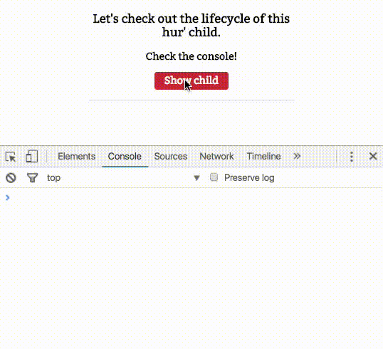

# Intro à Vue.js: Vue-cli et Hooks du cycle de vie

>**REMARQUE** : Cet article est une traduction en français de l'excellent article ["Intro to Vue.js: Vue-cli and Lifecycle Hooks"](https://css-tricks.com/intro-to-vue-3-vue-cli-lifecycle-hooks/) écrit par [Sarah Drasner](https://github.com/sdras)

## Introduction

This is the third part in a five-part series about the JavaScript framework, Vue.js. We'll cover Vue-cli, and talk a little more about real-life development processes. This is not intended to be a complete guide, but rather an overview of the basics to get you up and running so you can get to know Vue.js and understand what the framework has to offer.

> Série d'articles :
>  1. [Rendu, directives et événements](../intro-to-vue-1-rendering-directives-events)
>  2. [Composants, Props et Slots](../intro-to-vue-2-components-props-slots)
>  3. Vue-cli (Ce document !)
>  4. [Vuex](../intro-to-vue-4-vuex)
>  5. [Animations](../intro-to-vue-5-animations)

## Vue-cli and build processes

If you haven't yet read the last section on Vue.js components and props, I highly suggest you do so before reading this section, otherwise, some things we'll cover will lack context.

Vue offers a [really nice cli](https://github.com/vuejs/vue-cli) that gets you up and running with your choice of a few build tools, and really nice simple starter boilerplate. It's a lovely tool. Before installing vue-cli, you might want to check that your versions of node, and npm or yarn are up-to-date. You’d first want to install vue-cli (the -g helps you install it globally)

```console
$ npm install -g vue-cli
```

There are many builds available to you, but in our example, we'll use webpack:

```console
$ vue init webpack <project-name>
```

You can go through the commands that the output will give you, which will help you cd into the directory, install everything, set up your `package.json` file, and then finally serve up a local dev server at localhost:8080 with the command:

```console
$ npm run dev
```

You're up and running! I love that the setup is so clean. You'll start off with an App file in your `/src/` directory with a `Hello.vue` file in the `/components/` directory. This is really nice because you can see already how you'd set up these files, and how imports and exports might work.

Let’s go over this new `.vue` file extension for a moment, because if you haven’t worked with vue, you won’t have come across it before.

In your `.vue` file, you can place everything you need for your component. We no longer have to wrap our templates in `<script type="text/x-template">`, now we'll more semantically create files that follow this logic:

```HTML
<template>
  <div>
     <!-- Write your HTML with Vue in here -->
  </div>
</template>

<script>
  export default {
     // Write your Vue component logic here
  }
</script>

<style scoped>
  /* Write your styles for the component in here */
</style>
```

I've made a repo of [Vue snippets for Sublime Text](https://github.com/sdras/vue-sublime-snippets) to quickly spin up boilerplate like this for `.vue` files (this is what the snippet `vbase` would output). There's also [this one for atom](https://atom.io/packages/vue-snippets), (though it specifies version 1+, and Vue is at v2), and [this for vscode](https://github.com/OYsun/vscode-VueHelper).

A few things to note here: just like in React, you have to return exactly one enclosing tag, here I've used a div. I've also used `<g>` elements in SVG. It can be anything, but the entire template must be wrapped in the one tag.

You'll see that we'll use `export default` here to write our scripts such as the data function or methods we used previously, but if we were to use components as children in this `.vue` document, we would also have to import them (more on this in a minute).

You can also see that we have a special `scoped` value on the style tag. **This allows us to very easily scope the styles for this component to only this component**. We could also use just `<style>` and it would create styles for the whole application. I typically like to create a base stylesheet for the whole application with common styles like fonts and line-heights, which I'll `@import` into the `<style>` tag of the App.vue file with the help of [vue-style-loader](https://github.com/vuejs/vue-style-loader). I'll then use the `<style scoped>` tag for very particular styles for the template when it calls for it, but really to each their own on this one! The nice thing is that Vue-cli lets you decide how to organize it, and you don’t have to add any other dependencies or modules to scope our styles this way. *heart eyes*.

We spoke briefly about slots before, when we use slots in Vue components with the scoped style tags, **they apply to the component that has the slots**. This is so helpful, because you can switch out components and change the appearance out very easily. *heartier eyes*

I have to say that in terms of development workflow, working within each particular `.vue` file for my HTML, styles, and JS has been extraordinarily helpful. I love that things are separated enough to see each piece clearly, yet close enough together that **I'm not context-shifting**. It speeds up my development, and I've noticed that markup stays pretty semantic.

You also might notice that your syntax highlighter doesn’t automatically recognize `.vue` files, so [I’ve installed this](https://github.com/BrainBuzzer/vuejs-sublime-complete) for Sublime Text.

Here is the most basic way of importing/exporting components into a file (vimport:c in vue-sublime snippets)

JS
```javascript
import New from './components/New.vue';

export default {
  components: {
    appNew: New
  }
}
```

For more of a real-life example, let's look at a sample of that last wine-label demo we used, with the components separated out into their own templates:

**App.vue:**

JS
```javascript
<template>
  <div class="container">

  <main>
      <component :is="selected">
        <svg class="winebottle" aria-labelledby="title" xmlns="http://www.w3.org/2000/svg" viewBox="0 155 140 300">
          ...
      </svg>
      </component>
    </main>

    <aside>
      <h4>Name your Wine</h4>
      <input v-model="label" maxlength="18">
      <div class="button-row">
        <h4>Color</h4>
        <button @click="selected ='appBlack', labelColor = '#000000'">Black Label</button>
        <button @click="selected ='appWhite', labelColor = '#ffffff'">White Label</button>
        <input type="color" v-model="labelColor" defaultValue="#ff0000">
      </div>
    </aside>

  </div>
</template>

<script>
  import Black from './components/Black.vue'
  import White from './components/White.vue'
  ...
  export default {
      data: function () {
        return {
          selected: 'appBlack',
          label: 'Label Name',
          ...
        };
      },
      components: {
          appBlack: Black,
          appWhite: White,
          ...
      }
  }
</script>

<style>
  @import "./assets/style.css";
</style>
```

**Black Component:**

JS
```javascript
<template>
  <div>
    <slot></slot>
  </div>
</template>

<style scoped>
  .label {
    fill: black;
  }
  .bottle, .wine-text {
    fill: white;
  }
  .flor {
    fill: #ccc;
  }
  .bkimg {
    filter:url(#inverse)
  }
</style>
```

Note that I'm using the component here to style each slot differently, that's a really nice way of working, but it's only one way. There are endless ways you can compose your application with components, slots, and props. The code here also only shows a piece of what's happening. [I've made a repo](https://github.com/sdras/vue-wine-label) for you to explore, having used Vue-cli from the start to construct this. I highly recommend using Vue-cli in tandem with reading this and building out some components and passing state with props in a simple manner, just to get accustomed to the workflow. It's very intuitive and quick once you get past the initial setup!

## Lifecycle Hooks

Before we talk about lifecycle hooks, we need to backtrack a little and talk about the virtual DOM I mentioned in the first article. I noted that Vue.js has a virtual DOM, but not really what it does.

When you work with something like jQuery, in essence you're listening to the DOM, and changing things based on those updates. We end up spending a lot of time checking what the DOM is up to, and storing state there. In contrast, a virtual DOM is an abstract representation of a DOM, sort of like a copy, but in this case it will be our master copy. When we work with state the way we have been with Vue in these articles, we're creating the state ourselves, and then observing when the state changes.

When a Vue instance updates, Vue will check to see if it's different from what we had previously. If it is indeed different, it will call some of these lifecycle methods, and patch the actual DOM with changes. This is for efficiency, this way the DOM is only updating what it absolutely needs to.

The lifecycle hooks provide you a **method** so that you might trigger something precisely at different junctures of a component's lifecycle. Components are mounted when we instantiate them, and in turn unmounted, for instance when we toggle them in a v-if/v-else statement.

Some of the hooks available to you are: `beforeCreate`, `created`, `beforeMount`, `mounted`, `beforeUpdate`, `updated`, `activated`, `deactivated`, `beforeDestroy`, and `destroyed`. The API docs do a [good job of describing each)(https://vuejs.org/v2/api/#beforeCreate) if you'd like to dig in further. Here's a small demo to show how some of them work (check the console):

JS
```javascript
const Child = {
  template: '#childarea',
  beforeCreate() {
    console.log("beforeCreate!");
  },
 ...
};

new Vue({
  el: '#app',
  data() {
    return {
      isShowing: false
    }
  },
  methods: {
    toggleShow() {
      this.isShowing = !this.isShowing;
    }
  },
  components: {
    appChild: Child
  }
});
```

HTML
```HTML
<div v-if="isShowing">
  <app-child></app-child>
</div>
```

*[Démo](http://codepen.io/sdras/pen/28d3a5b277ada8f9d1b0b34a2d73831c)*



Note that we use `v-if` here instead of `v-show`, as `v-if` will actually mount and unmount the component, while `v-show` will only toggle visibility (but it will remain mounted and stay in the DOM). Similarly, `<keep-alive></keep-alive>` will not be mounted or unmounted, but rather become activated and deactivated- as the component remains mounted, but is not in use.

Just as the methods available on the component bind this automatically, lifecycle hooks also auto-bind to the instance so that you can use the component’s state, and methods. Again, you don't have to console.log to find out what `this` refers to! **heartiest eyes** For this reason though, you shouldn’t use an arrow function on a lifecycle method, as it will return the parent instead of giving you nice binding out of the box.

In the following I’m moving a ton of elements when each component is initially mounted, so I'll use the mounted hook to trigger the corresponding animation for each component. **You may have to hit the rerun button in the bottom left corner to see the starting animation.**

*[Démo](http://codepen.io/sdras/pen/YNpaoJ)*

JS
```javascript
 mounted() {
    let audio = new Audio('https://s3-us-west-2.amazonaws.com/s.cdpn.io/28963/rain.mp3'),
        tl = new TimelineMax();

    audio.play();
    tl.add("drops");

    //drops in
    tl.staggerFromTo("#droplet-groups g path", 0.3, {
      drawSVG: "0% -10%"
    }, {
      drawSVG: "100% 110%",
      repeat: 3,
      repeatDelay: 1,
      ease: Sine.easeIn
    }, 0.5, "drops");
 …
}
```

There are also beautiful and sophisticated `<transition>` and `<transition-group>` components that Vue offers and we use elsewhere in this demo, and we’ll cover these, and why and when to use each in the last post of the series on Animation.

> Série d'articles :
>  1. [Rendu, directives et événements](../intro-to-vue-1-rendering-directives-events)
>  2. [Composants, Props et Slots](../intro-to-vue-2-components-props-slots)
>  3. Vue-cli (Ce document !)
>  4. [Vuex](../intro-to-vue-4-vuex)
>  5. [Animations](../intro-to-vue-5-animations)
